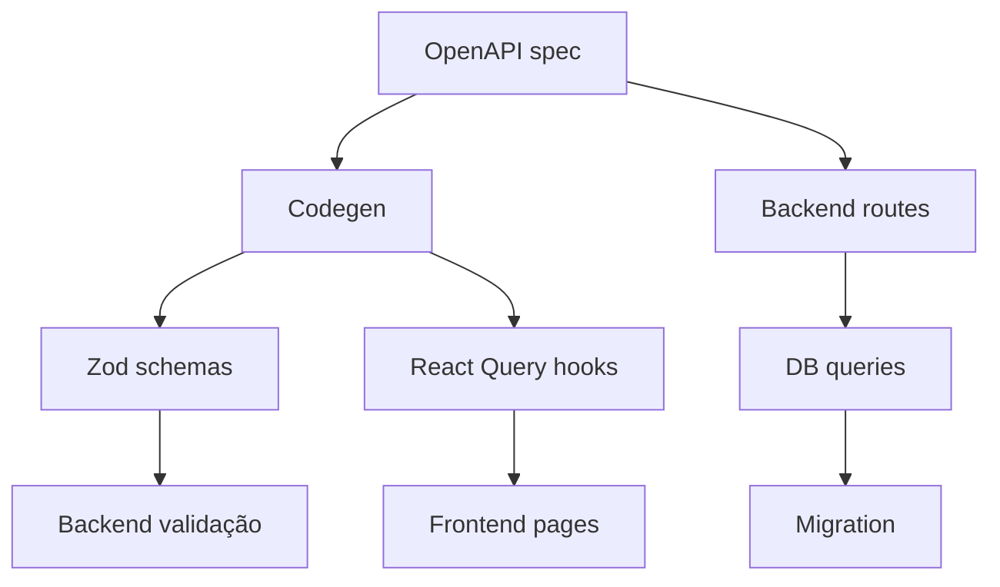

# Aprendizagem — Unified HRIS + Checkei

## O que este documento registra

A engenharia reversa completa do **motor do Replit Agent** a partir de dois projetos reais:
- **Unified HRIS** — frontend-only (React + Vite, 32 páginas, mock data)
- **Checkei** — full-stack (React + Express + PostgreSQL + Drizzle + WhatsApp + Scheduler)

Cada projeto revelou camadas diferentes do motor. Juntos, formam o mapa completo.

---

## Parte 1: A Arquitetura Real do Replit Agent

### 1.1 O que NÃO é

- Não é "skills mágicas" que o agente lê e executa
- Não é um monólito que faz tudo sozinho
- Não é um template estático que gera código

### 1.2 O que É

```
┌──────────────────────────────────────────────────────────────┐
│                     AGENTE PRINCIPAL                          │
│  (orquestrador, não executor)                                │
├──────────────────────────────────────────────────────────────┤
│                                                              │
│  1. READ inputs (PRD + skills como checklist)                │
│  2. PLAN → .docs/PLANS/*.md + Task (DRAFT→PROPOSED→ACTIVE)  │
│  3. WAIT approval → auto Plan→Build                          │
│  4. CREATE artifact (template scaffold)                      │
│  5. LAUNCH DESIGN subagent (brief sob medida)                │
│  6. WAIT subagent → VERIFY (typecheck + screenshot)          │
│  7. SUBMIT → QUALITY GATE LOOP:                              │
│     ├── Audit → Classify → Prioritize → Batch Fix            │
│     ├── Typecheck + Browser Verify                           │
│     └── Resubmete → LOOP até passar                          │
│  8. COMPLETE                                                 │
│                                                              │
└──────────────────────────────────────────────────────────────┘
```

### 1.3 O Subagente (startAsyncSubagent)

O Replit Agent tem **startAsyncSubagent** como primitiva nativa no runtime:

```javascript
startAsyncSubagent({
  specialization: "DESIGN",     // papel explícito
  task: "...",                  // prompt sob medida, não skill genérica
  relevantFiles: [...],         // caminhos exatos, sem exploração
})
```

**Características:**
- **Especializado** — recebe identidade (DESIGN, BACKEND, DATABASE)
- **Contextualizado** — recebe `relevantFiles` com caminhos exatos
- **Task-driven** — o prompt é a tarefa completa, não template
- **Async + paralelo** — todos rodam juntos, main aguarda merge

**Limitação descoberta:** O subagente de design **falha em full-stack** porque os hooks de API (React Query) não existem até o codegen rodar. No HRIS (mock data), ele entregou 32 páginas de primeira. No Checkei (full-stack), gerou stubs vazios.

### 1.4 Tasks como State Machine

Não é arquivo markdown. É **objeto de sistema** com estado:

```
DRAFT → PROPOSED → ACTIVE → COMPLETE
                      ↓
              (auto Plan→Build)
```

- Transição automática quando usuário aprova
- Checkpoint/rollback nativo
- Rastreável (todo round de correção fica registrado)

---

## Parte 2: O Quality Gate (Coração do Motor)

### 2.1 O Loop Recursivo

Cada "Validation failed" revela issues **em nível diferente de profundidade**:

```
HRIS (5-6 rounds):
Round 1: ❌ Placeholders (arquivos < 30 linhas)
Round 2: ❌ Hooks ordering violation (useState após return)
Round 3: ❌ Admin stubs
Round 4: ❌ Loading states ausentes (~15 páginas)
Round 5: ❌ ErrorState não usado + Tabs vazias

Checkei (10+ rounds):
Round 1:  ❌ Segurança (auth faltando, JWT fixo)
Round 2:  ❌ Schema/DB mismatch
Round 3:  ❌ Regressão de tipos (stale dist/)
Round 4:  ❌ Funcional (checklist não salva teamIds)
Round 5:  ❌ Arquitetural (JWT → session auth)
Round 6:  ❌ Rotas (/checklists/ → /manager/checklists/)
Round 7:  ❌ Sincronização (team_members não sync)
Round 8:  ❌ Navegação (URLs stale)
Round 9:  ❌ Schemas incompletos (scheduleTime ausente)
Round 10: ❌ Sistema (cache-flush, system/reset)
```

**Padrão:** Não adianta acertar tudo de uma vez. O quality gate opera como **cebola** — a cada round revela uma camada mais profunda.

### 2.2 Classificação de Issues

Durante o Checkei, o agente **explicitamente** classificou cada issue:

| Tipo | Classificação | Exemplo |
|---|---|---|
| Placeholder | ✅ Acionável | `inbox.tsx (18 lines)` |
| Hook ordering | ✅ Acionável | `useState` após `if return` |
| Missing states | ✅ Acionável | loading/empty/error |
| Tabs vazias | ✅ Acionável | folha 5/6 tabs sem conteúdo |
| **wouter vs React Router** | 🚫 **Não acionável** | Constraint do template |
| Segurança | ✅ Acionável | auth middleware faltando |
| Schema/DB mismatch | ✅ Acionável | coluna faltando |
| **Routing library** | 🚫 **Não acionável** | Monorepo constraint |

**Regra de ouro:** Issues não acionáveis são documentadas no commit e ignoradas no quality gate. Isso evita retrabalho infinito.

### 2.3 Os 3 Níveis de Profundidade

| Nível | O que detecta | Exemplo real | Bloqueia? |
|---|---|---|---|
| **L1 — Estrutural** | Placeholders, hook ordering, typecheck error | `inbox.tsx (18 lines)` | ✅ Sim |
| **L2 — Estados** | Missing loading/empty/error states | `dashboard.tsx` sem `useEffect` | ✅ Sim |
| **L3 — Conteúdo** | Tabs vazias, dados genéricos ("Colaborador N") | `folha.tsx` (5/6 tabs vazias) | ⚠️ Recomendado |

### 2.4 A Auditoria Sistemática

O agente rodou **scan em TODAS as páginas** classificando cada uma:

```bash
for f in pages/*.tsx pages/admin/*.tsx; do
  has_loader=$(grep -l "PageLoader" $f)
  has_empty=$(grep -l "EmptyState" $f)
  has_error=$(grep -l "ErrorState" $f)
  echo "$page | loader=$has_loader | empty=$has_empty | error=$has_error"
done
```

Isso gerou uma **matriz de cobertura** que guiou todo o resto. Sem isso, as correções seriam aleatórias.

---

## Parte 3: Full-Stack vs Frontend-Only

### 3.1 Diferenças Fundamentais

| Aspecto | HRIS (Frontend-Only) | Checkei (Full-Stack) |
|---|---|---|
| **Rounds de quality gate** | 5-6 | **10+** |
| **Duração** | ~1h15m | **~25 dias** |
| **Subagentes** | 1 (DESIGN) | Múltiplos |
| **Complexidade** | Mock data | DB + auth + scheduler + WhatsApp |
| **Critical path** | N/A | **OpenAPI spec + codegen** |
| **Dependências** | Nenhuma | Schema → codegen → lib → frontend |

### 3.2 O OpenAPI Spec é o Critical Path

No full-stack, **tudo depende do OpenAPI spec**:

```
OpenAPI spec
  ├── Codegen (Orval)
  │     ├── Zod schemas (lib/api-zod)
  │     └── React Query hooks (lib/api-client-react)
  │           └── Frontend pages usam os hooks
  └── Backend routes implementam a spec
```

Quando o spec muda → **toda a cadeia quebra**:



Cada mudança no spec exige:
1. Editar `openapi.yaml`
2. Rodar codegen
3. Rebuild libs (tsc --build para dist/)
4. Rebuild backend
5. Rodar testes E2E

### 3.3 Subagente de Design Só Funciona se Codegen Já Rodou

O subagente de design no Checkei **gerou stubs vazios** porque tentou importar hooks (`useListChecklists`, `useMe`, etc.) que ainda não existiam — o codegen não tinha rodado.

**Pré-requisito obrigatório para full-stack:**
1. OpenAPI spec completo
2. Codegen executado sem erro
3. Libs compiladas (dist/ atualizado)
4. **Só então** lançar design subagent

---

## Parte 4: O Padrão de Correção

### 4.1 Em Frontend-Only (HRIS)

```
Auditoria → scan todas páginas × 3 dimensões
Classificar → ações vs não acionáveis
Priorizar → placeholders > loading > error > tabs
Batch paralelo → todas edições do mesmo tipo juntas
Verificar → typecheck + browser console (HMR)
Resubmeter → validation gate
```

Cada batch é **paralelo máximo** — o agente edita 8-10 arquivos por vez.

### 4.2 Em Full-Stack (Checkei)

As correções seguem **cadeias de dependência**:

```
Schema change → migration → DB push → codegen → lib rebuild → frontend
               ↘ backend route update

Auth change → middleware → routes → frontend hooks → login/logout pages

Scheduler → alert logic → webservice → dashboard live updates
```

Cada correção envolve **4-6 arquivos em camadas diferentes** — schema, spec, backend, frontend, tudo ao mesmo tempo.

### 4.3 A Estratégia de Correção Ideal

```
1. Scan completo → for loop em todas as dimensões
2. Classificar → acionável vs não acionável
3. Priorizar por gravidade:
   - Crítica: placeholder, segurança, schema mismatch
   - Alta: loading/error states, funcional
   - Média: conteúdo, dados genéricos
   - Baixa: UI polish, copy
4. Batch paralelo máximo → todas edições do mesmo tipo
5. Verificar → typecheck + browser + curl + E2E
6. Resubmeter → validation gate decide
```

---

## Parte 5: Implementação no Codex

### 5.1 Quality Gate — 3 Níveis

**Script: `~/.codex/hooks/qg.py`**

```bash
python qg.py --path <projeto> --level 1  # Estrutural: placeholders, hook ordering, typecheck
python qg.py --path <projeto> --level 2  # Estados: loading, empty, error
python qg.py --path <projeto> --level 3  # Conteúdo: tabs, dados genéricos
```

Retorno:
```json
{
  "pass": false,
  "issues": [
    {"file": "inbox.tsx", "type": "placeholder", "lines": 18, "severity": "critical"},
    {"file": "configuracoes.tsx", "type": "hook_ordering", "severity": "critical"},
    {"file": "dashboard.tsx", "type": "missing_loading", "severity": "high"}
  ],
  "blockers": 2,
  "warnings": 1,
  "non_actionable": ["wouter vs React Router"]
}
```

**7 checks por nível:**

| Check | O que detecta | Nível |
|---|---|---|
| Placeholder | Arquivo .tsx < 30 linhas | L1 |
| Hook ordering | `useState`/`useEffect` após `if (...) return` | L1 |
| TypeScript | `pnpm typecheck` exit code ≠ 0 | L1 |
| Module gating | Página sem `getModuleStatus` | L2 |
| Loading state | Página sem `useEffect` + `loading` state | L2 |
| Empty state | Página com search sem `EmptyState` | L2 |
| Error state | Página sem `ErrorState` component | L2 |
| Admin stub | Admin page com "aqui" ou "placeholder" | L3 |
| Tabs vazias | `TabsContent` sem conteúdo real | L3 |
| Dados genéricos | "Colaborador N", "Test", "Lorem" | L3 |
| Cadeia completa | schema → codegen → lib → frontend executou? | L1 (full-stack) |

### 5.2 AGENTS.md — Workflow Obrigatório

```markdown
## Quality Gate (OBRIGATÓRIO - 3 NÍVEIS)
Antes de marcar task como COMPLETE:

### Nível 1 — Estrutural (BLOQUEANTE)
python qg.py --path <projeto> --level 1
Se blocker > 0 → resolva TODOS antes de prosseguir

### Nível 2 — Estados (BLOQUEANTE)
python qg.py --path <projeto> --level 2
Se blocker > 0 → resolva TODOS

### Nível 3 — Conteúdo (RECOMENDADO)
python qg.py --path <projeto> --level 3
Se blocker > 0 → resolva ou justifique no commit

### Regras:
- Issues NÃO acionáveis → documentar no commit com #skip
- Cada nível só roda após o anterior passar
- Se quality gate rejeitar 3+ vezes → pausar e perguntar ao usuário

### Full-Stack (se aplicável):
- [ ] OpenAPI spec completo antes de codegen
- [ ] Codegen executado sem erro
- [ ] Libs compiladas (tsc --build)
- [ ] Só então lançar design subagent
```

### 5.3 Atualizar `project-lifecycle` Skill

No passo **Ship**, substituir checklist genérico por:

```markdown
### Ship — Quality Gate
- [ ] Nível 1 (Estrutural): placeholders, hook ordering, typecheck — passou
- [ ] Nível 2 (Estados): loading, empty, error states por página — passou
- [ ] Nível 3 (Conteúdo): tabs, dados genéricos — passou ou justificado
- [ ] Issues não acionáveis documentadas no commit (#skip)
- [ ] Full-stack: cadeia schema→codegen→lib→frontend completa
```

### 5.4 Hook `stop.py` (Opcional)

Executar `qg.py --level 1` automaticamente no stop e **logar warnings sem bloquear**:

```python
subprocess.run(["python", "~/.codex/hooks/qg.py", "--path", project_path, "--level", "1"])
# Loga issues como warning, não interrompe
```

### 5.5 Ordem de Implementação

```
1. Criar qg.py com todos os checks (7 por nível, 3 níveis)
2. Testar contra ~/.agents/templates/fullstack-monorepo/
3. Atualizar ~/.codex/AGENTS.md
4. Atualizar ~/.agents/skills/project-lifecycle/SKILL.md
5. (Opcional) Atualizar ~/.codex/hooks/stop.py
6. Testar ciclo completo:
   build template → qg L1 → corrigir → qg L2 → corrigir → qg L3 → corrigir → submit
```

---

## Parte 6: Por Que Tudo Isso É Necessário

### 6.1 O Problema Atual no Codex

| Situação | Consequência |
|---|---|
| Skills são passivas | Agente precisa lembrar de ler |
| Sem quality gate | Placeholders passam |
| Sem task state machine | Sem rastreabilidade |
| Sem verificação de cadeia full-stack | Regressão silenciosa |
| Sem classificação de issues | Retrabalho infinito |

### 6.2 O Que o Quality Gate Resolve

| Problema | Como o QG resolve |
|---|---|
| Placeholder passa despercebido | L1 detecta arquivos < 30 linhas |
| Hook ordering quebra runtime | L1 detecta useState após return |
| Missing states degrada UX | L2 detecta ausência de loading/empty/error |
| Dados genéricos parece amador | L3 detecta "Colaborador N" |
| Regressão de tipos | L1 roda typecheck automaticamente |
| Cadeia full-stack incompleta | L1 verifica schema→codegen→lib→frontend |
| Issue não acionável gera loop | Classificação explícita evita retrabalho |

### 6.3 O Custo de Não Ter Quality Gate

**Cenário entregue sem quality gate:**
- 32 páginas criadas, mas 10 são stubs
- 0 placeholders detectados
- 15 páginas sem loading state
- 7 páginas sem module gating
- Usuário descobre só depois de testar

**Cenário com quality gate:**
- L1 detecta 5 stubs → corrige antes do submit
- L2 detecta 15 páginas sem loading → adiciona em batch
- L3 detecta tabs vazias → preenche conteúdo
- Entrega limpa de primeira

### 6.4 A Meta Final

Transformar o Codex de **"assistente que ajuda se você pedir"** para **"motor de entrega programático"** — onde o agente:
1. Planeia com task rastreável
2. Submete a quality gate automático
3. Corrige iterativamente até passar
4. Só apresenta ao usuário quando está completo

---

## Apêndice A: Como Conversam os Componentes

```
~/.codex/AGENTS.md
  ├── workflow global (Plan→Approve→Code→Test→Review→Ship)
  ├── quality gate obrigatório antes de COMPLETE
  └── full-stack prerequisites
       │
~/.codex/hooks/qg.py
  ├── L1: placeholders, hook ordering, typecheck, cadeia full-stack
  ├── L2: loading, empty, error states, module gating
  ├── L3: tabs vazias, dados genéricos, admin stubs
  └── classificação: acionável vs não acionável
       │
~/.codex/hooks.json
  ├── SessionStart → carrega chronicle
  ├── PreToolUse → security check
  ├── PostToolUse → review
  └── Stop → qg.py --level 1 (log only)
       │
~/.agents/skills/project-lifecycle/SKILL.md
  └── Ship: quality gate checklist
       │
~/.agents/skills/chronicle/SKILL.md
  └── memória entre sessões (esta análise)
       │
~/.agents/templates/fullstack-monorepo/
  ├── apps/api/ → backend
  ├── lib/api-spec/ → OpenAPI spec + codegen
  ├── lib/api-zod/ → Zod schemas
  ├── lib/api-client-react/ → React Query hooks
  └── packages/db/ → Drizzle schema + migrations
       │
~/.codex/superpowers/ (junction)
  └── 14 superpowers skills complementares
```

**O fluxo completo:**

```
AGENTS.md
  ├── instrui: "use project-lifecycle skill"
  │     └── project-lifecycle → "siga os passos"
  │           ├── Plan: .docs/ + Task
  │           ├── Code: artifact + subagentes
  │           ├── Test: typecheck + E2E
  │           ├── Review: chronicle recall
  │           └── Ship: quality gate (qg.py L1→L2→L3)
  └── instrui: "use chronicle para contexto"
        └── chronicle → "lembre-se do que já fizemos"
```

---

## Apêndice B: Resumo das Mudanças Necessárias

| O quê | Arquivo | Mudança |
|---|---|---|
| Quality gate script | `~/.codex/hooks/qg.py` | Criar — 3 níveis, 7+ checks cada |
| Workflow obrigatório | `~/.codex/AGENTS.md` | Adicionar seção Quality Gate |
| Skill atualizada | `~/.agents/skills/project-lifecycle/SKILL.md` | Ship checklist com QG |
| Hook opcional | `~/.codex/hooks/stop.py` | Executar QG L1 e logar |
| Documento de análise | `~/.agents/skills/aprendizagem.md` | Este arquivo (criado) |
