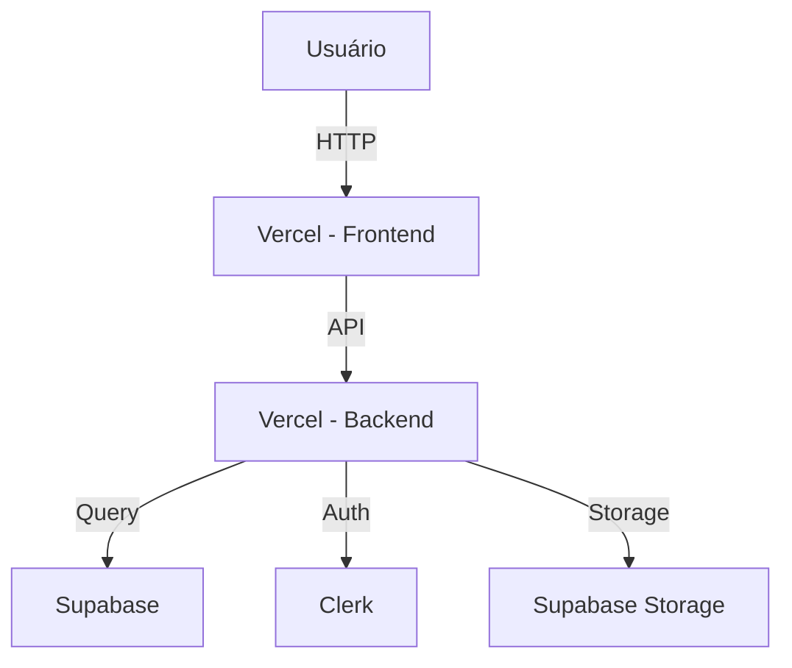

# Canvas - Prototipação Visual

No Codex, não existe um canvas interativo embutido. Em vez disso, o agente cria **código executável** que você visualiza no navegador. Use as técnicas abaixo para prototipar visualmente.

**Se o projeto usa shadcn/ui** (recomendado), PREFIRA componentes shadcn em vez de HTML cru:

```tsx
import { Button } from '@/components/ui/button'
import { Card, CardContent } from '@/components/ui/card'
import { Input } from '@/components/ui/input'
```

## Quando Usar

- Criar wireframes e mockups de UI
- Comparar variantes de design lado a lado
- Fazer diagramas de arquitetura ou fluxo
- Prototipar componentes antes de integrar no app principal
- Apresentar opções de design para o usuário

## Como Funciona

O agente gera **arquivos HTML/CSS/React** que rodam no navegador. Você vê o resultado abrindo o arquivo ou rodando um servidor dev.

## Técnicas de Prototipação

### Técnica 1: Componente Isolado (React + Vite)

Crie um componente isolado para prototipação rápida:

```bash
# Cria um projeto de prototipação
mkdir -p prototipos && cd prototipos
npm create vite@latest . -- --template react-ts
```

```tsx
// src/prototipos/Card.tsx — protótipo isolado
export function PricingCard() {
  return (
    <div className="max-w-sm rounded-xl border p-6 shadow-sm">
      <h3 className="text-lg font-bold">Pro</h3>
      <p className="mt-2 text-3xl font-bold">R$ 97/mês</p>
      <ul className="mt-4 space-y-2">
        <li className="flex items-center gap-2">✓ 10 usuários</li>
        <li className="flex items-center gap-2">✓ Suporte prioritário</li>
      </ul>
    </div>
  );
}
```

### Técnica 2: HTML Puro (Sem Framework)

Para wireframes rápidos, crie um HTML inline:

```html
<!DOCTYPE html>
<html lang="pt-br">
<head>
  <meta charset="UTF-8">
  <meta name="viewport" content="width=device-width, initial-scale=1.0">
  <script src="https://cdn.tailwindcss.com"></script>
  <title>Wireframe - Dashboard</title>
</head>
<body class="bg-gray-50 p-8">
  <div class="mx-auto max-w-6xl">
    <h1 class="text-2xl font-bold">Dashboard</h1>
    <!-- Grid de cards -->
    <div class="mt-6 grid grid-cols-3 gap-4">
      <div class="rounded-lg bg-white p-4 shadow">
        <p class="text-sm text-gray-500">Receita</p>
        <p class="text-2xl font-bold">R$ 45.200</p>
      </div>
      <div class="rounded-lg bg-white p-4 shadow">
        <p class="text-sm text-gray-500">Pedidos</p>
        <p class="text-2xl font-bold">1.342</p>
      </div>
      <div class="rounded-lg bg-white p-4 shadow">
        <p class="text-sm text-gray-500">Clientes</p>
        <p class="text-2xl font-bold">892</p>
      </div>
    </div>
  </div>
</body>
</html>
```

### Técnica 3: Múltiplas Variantes

Para comparar designs, crie uma página com todas as variantes:

```tsx
import { CardV1 } from './variants/CardV1';
import { CardV2 } from './variants/CardV2';
import { CardV3 } from './variants/CardV3';

export function VariantComparison() {
  return (
    <div className="grid grid-cols-3 gap-8 p-8">
      <div>
        <h2 className="mb-4 text-sm font-semibold uppercase text-gray-500">Variante A</h2>
        <CardV1 />
      </div>
      <div>
        <h2 className="mb-4 text-sm font-semibold uppercase text-gray-500">Variante B</h2>
        <CardV2 />
      </div>
      <div>
        <h2 className="mb-4 text-sm font-semibold uppercase text-gray-500">Variante C</h2>
        <CardV3 />
      </div>
    </div>
  );
}
```

### Técnica 4: Diagramas com Mermaid

Para diagramas de arquitetura, fluxo, ou banco:

```markdown


Use ferramentas como Mermaid Live Editor ou extensão do VS Code para visualizar.

## Workflow de Design

1. **Entenda o requisito** — O que precisa ser prototipado?
2. **Escolha a técnica** — HTML puro para wireframes, React para componentes, Mermaid para diagramas
3. **Crie o protótipo** — Gere o código e informe o usuário onde está
4. **Itere** — O usuário vê no navegador e pede ajustes
5. **Graduação** — Quando aprovado, mova o código para o app principal

## Dicas

- **Wireframes rápidos**: HTML + Tailwind CDN (sem instalação)
- **Componentes**: React + Vite (scaffold rápido)
- **Diagramas**: Mermaid dentro do Markdown
- **Responsivo**: Teste redimensionando a janela do navegador
- **Comparação**: Use grid com 2-3 variantes lado a lado
- Entregue o código, não uma imagem — o usuário pode ver no navegador
- Para protótipos de alta fidelidade, use a técnica React + Vite
